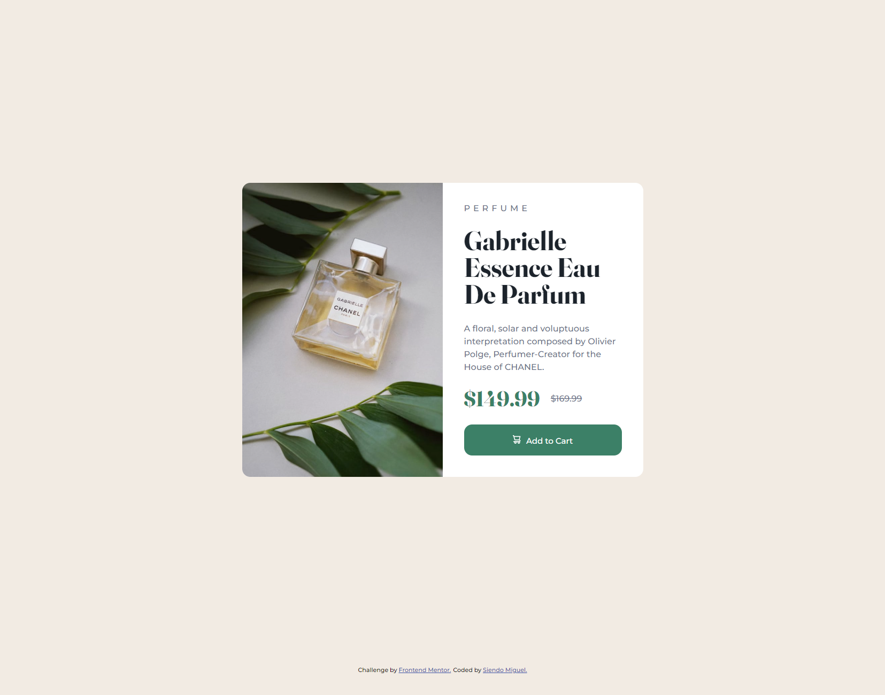

# Frontend Mentor - Product preview card component solution

This is a solution to the [Product preview card component challenge on Frontend Mentor](https://www.frontendmentor.io/challenges/product-preview-card-component-GO7UmttRfa). Frontend Mentor challenges help you improve your coding skills by building realistic projects. 

## Table of contents

- [Overview](#overview)
  - [The challenge](#the-challenge)
  - [Screenshot](#screenshot)
  - [Links](#links)
- [My process](#my-process)
  - [Built with](#built-with)
  - [What I learned](#what-i-learned)
  - [Continued development](#continued-development)
  - [Useful resources](#useful-resources)
- [Author](#author)
- [Acknowledgments](#acknowledgments)

**Note: Delete this note and update the table of contents based on what sections you keep.**

## Overview

### The challenge

Users should be able to:

- View the optimal layout depending on their device's screen size
- See hover and focus states for interactive elements

### Screenshot



### Links

- Solution URL: [Add solution URL here](https://www.frontendmentor.io/solutions/product-card-responsive-desing-html-and-css-FZ3VTsDlD4)
- Live Site URL: [Add live site URL here](https://siendomiguel.github.io/product-preview-card-component/)

## My process

### Built with

- Semantic HTML5 markup
- CSS custom properties
- Flexbox
- CSS Grid
- Mobile-first workflow

### What I learned

With this challenge I learned a couple of things regarding CSS, some of them were:

#### Using the link tag in HTML to call google fonts:
I investigated what is more recommended and found that it is more efficient to call the google fonts inside the header tag, with link than inside the CSS file
```html
<link href="https://fonts.googleapis.com/css2?family=Montserrat:wght@500;700&display=swap" rel="stylesheet">
```

#### Take full page view and center the content:
Thanks to the use of the measure of vh and flexbox
```css
.container {
  width: 100%;
  height: 95vh;
  display: flex;
  justify-content: center;
  place-items: center;
}
```

#### Independent rounded edges:
The use of the border-top-left-radius property
```css
.product-img img {
  object-fit: cover;
  width: 100%;
  height: 100%;
  border-top-left-radius: 15px;
  border-bottom-left-radius: 15px;
}
```

#### Line spacing, strikethrough, and character spacing:
The use of properties that affect text elements, such as letter-spacing, line-height, and text-decoration
```css
.text-product {
  letter-spacing: 6px;
  text-decoration:line-through;
  line-height: 1.5;
}
```

### Continued development

The theme of centering a content with CSS cost me a bit, I'm still practicing and improving this aspect.

In addition, the handling of the grid in rows was also difficult when adapting to the mobile view.

The handling of images and the object-fit property was also a problem and I'm still investigating this.

## Author

- Frontend Mentor - [@siendomiguel](https://www.frontendmentor.io/profile/siendomiguel)
- Twitter - [@siendomigueldev](https://www.twitter.com/siendomigueldev)
